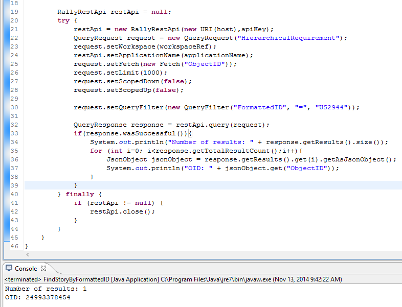

Find a UserStory by FormattedID
=========================

## Overview
The code is based on [Rally Rest Toolkit for Java](https://github.com/RallyTools/RallyRestToolkitForJava)
and tested with [rally-rest-api-2.1.1.jar](https://github.com/RallyTools/RallyRestToolkitForJava/releases/download/v2.1.1/rally-rest-api-2.1.1.jar)

Here is a screenshot showing all jars:

Screenshot of the console after the code is run:

## License
This app is vailable AS IS. It is NOT supported by Rally.
AppTemplate is released under the MIT license.  See the file [LICENSE](./LICENSE) for the full text.

##Documentation for API toolkit

You can find the documentation on this [site.](https://github.com/RallyTools/RallyRestToolkitForJava/wiki/User-Guide)
