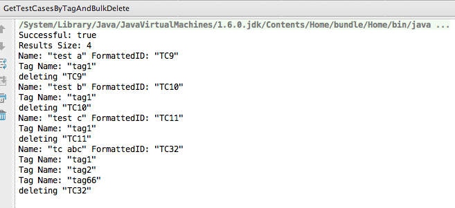

Get TestCases by Tag and bulk delete.
=========================

## Overview
WARNING: THIS CODE EXAMPLE DELETES DATA, RUN IT AT YOUR OWN RISK.

MAKE SURE THAT YOUR QUERY RETURNS TESTCASES YOU WANT TO DELETE.

THE CODE IS FOR DEMO PURPOSES ONLY AND IS NOT SUPPORTED BY RALLY.

The code is based on [Rally Rest Toolkit for Java](https://github.com/RallyTools/RallyRestToolkitForJava)
and tested with [rally-rest-api-2.1.1.jar](https://github.com/RallyTools/RallyRestToolkitForJava/releases/download/v2.1.1/rally-rest-api-2.1.1.jar)

Your query criteria can be different, but if you choose to identify test cases by tag, note that Tags.Name contains "tag1" returns test cases that may have more than one tag applied, and not only those that have a single "tag1".

Screenshot of the console after the code is run shows a test case TC32 that has three tags. It will be deleted since it still meets the query criteria.

## License
This app is available AS IS. It is NOT supported by Rally.
AppTemplate is released under the MIT license.  See the file [LICENSE](./LICENSE) for the full text.

##Documentation for API toolkit

You can find the documentation on this [site.](https://github.com/RallyTools/RallyRestToolkitForJava/wiki/User-Guide)
