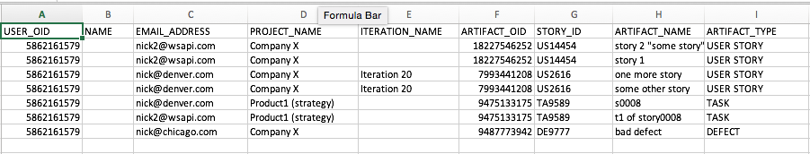
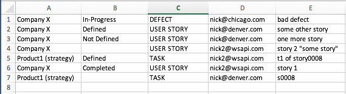

CSV import/exporter
=========================

## Overview

This app parses CSV file that contains data from an old workspace to match it to data in the new workspace after workspace migration.
ObjectIDs in the import CSV file are no longer valid. The app queries the new workspace for artifacts by Name after parsing import.csv file for Names.
The goal is to match the artifacts with owners, and get additional information from Rally, e.g. State or ScheduleState of artifats, that is not available from import.csv.

Here is import.csv file:

and the resulting export.csv file:

The code is based on [Rally Rest Toolkit for Java](https://github.com/RallyTools/RallyRestToolkitForJava)
and tested with [rally-rest-api-2.1.1.jar](https://github.com/RallyTools/RallyRestToolkitForJava/releases/download/v2.1.1/rally-rest-api-2.1.1.jar)

## License
This app is vailable AS IS. It is NOT supported by Rally.
AppTemplate is released under the MIT license.  See the file [LICENSE](./LICENSE) for the full text.

##Documentation for API toolkit

You can find the documentation on this [site.](https://github.com/RallyTools/RallyRestToolkitForJava/wiki/User-Guide)
